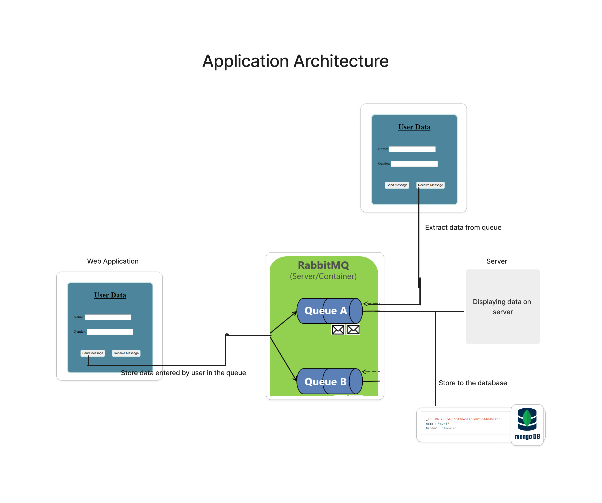

                                     IoT Data Handling System

Project Description:

The IoT Data Handling System is designed to handle incoming MQTT messages via RabbitMQ and store them efficiently in MongoDB. This project involves integrating MQTT messaging with RabbitMQ, processing messages in Python, and storing data in MongoDB.
Below are the details on setting up the project, requirements, and other necessary information.

Setup:

RabbitMQ Setup:
Install RabbitMQ on your system.
Enable the MQTT plugin in RabbitMQ to handle MQTT messages.
Configure RabbitMQ to accept connections and messages.
Running on your localhost . http://localhost:15672/

Python Environment Setup:
Install Python 3.x on your system if not already installed.
Create a virtual environment for the project.

MongoDB Setup:

Install MongoDB on your system.
Configure MongoDB to accept connections.
Running on your system

Python Dependencies:
Flask: pip install Flask
Flask-CORS: pip install flask-cors
Pika (RabbitMQ Python client): pip install pika
PyMongo (MongoDB Python driver): pip install pymongo

Project Structure:
In Iot_system we have three files listed below -
backend.py: Python script for the Flask-based backend that handles MQTT messages, RabbitMQ integration, and MongoDB interaction.
home.html: HTML file for the frontend interface to send and receive MQTT messages.
home.css: CSS file for styling the frontend interface.

** HOW TO RUN A PROJECT ON YOUR LOCALHOST **

Prerequisites:
 - > Ensure you have Python installed on your system.
 - > Make sure RabbitMQ and MongoDB are installed and running successfully on your local system.
 Step 1 : Clone the repository to your local machine:
 - git clone https://github.com/avnichauhan12/IoT_Data_Handling_System.git
Step 2 : Navigate to the project directory:
 - cd iot_data_handling_system
Step 3 : Install the required Python dependencies:
   pip install -r requirements.txt
Running the Backend:
 - Start the Flask backend server by running the following command:
<python backend.py>
This will start the backend server, which will listen for HTTP requests on localhost:5000.

Running the Frontend:
Open the home.html file in your web browser or host it on a local server.

** Using the Application:

 - Fill in the user data (name and gender) in the form provided on the web interface.
 - Click the "Send Message" button to submit the data.
** To receive and store the data in the database:
 - Ensure RabbitMQ is running.
 - Click the "Receive Message" button.

By following these steps, you can run the IoT Data Handling System project locally on your machine. Make sure to have RabbitMQ and MongoDB running to ensure proper functioning of the application.
Enjoy exploring the functionalities of the system!

